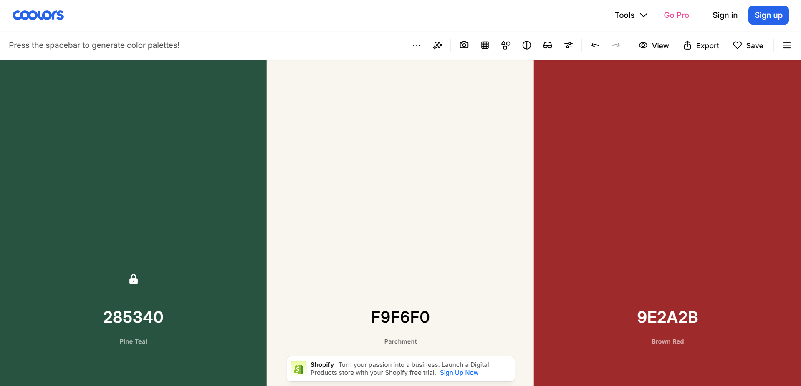

Green - 285340
White - F9F6F0
Red - 9E2A2B

## Directory Tree
gstar-travel/
├── .next/                   # Next.js build output (auto-generated)
├── node_modules/            # Project dependencies
├── public/                  # Static files (images, icons, robots.txt, etc.)
├── src/
│   ├── app/                 # App Router (pages, layouts, routes)
│   │   ├── (auth)/          # Route group for auth-related pages
│   │   │   ├── login/
│   │   │   │   └── page.tsx
│   │   │   └── register/
│   │   │       └── page.tsx
│   │   ├── (dashboard)/     # Route group for dashboard
│   │   │   ├── dashboard/
│   │   │   │   └── page.tsx
│   │   │   └── settings/
│   │   │       └── page.tsx
│   │   ├── (weebsite)/     # Route group for Landing Website
│   │   │   │   └── page.tsx
│   │   ├── api/             # API Routes
│   │   │   ├── auth/
│   │   │   │   └── route.ts
│   │   │   └── users/
│   │   │       └── route.ts
│   │   ├── layout.tsx       # Root layout
│   │   ├── template.tsx     # Optional template
│   │   ├── loading.tsx      # Global loading UI
│   │   ├── error.tsx        # Global error UI
│   │   └── not-found.tsx    # 404 page
│   │   
│   ├── components/          # Reusable UI components
│   │   ├── ui/              # Base UI (Button, Input, Card...)
│   │   ├── layout/          # Header, Footer, Sidebar...
│   │   └── shared/          # Shared components
│   ├── features/            # Feature-based modules
│   │   ├── auth/            # Login, Register, Auth logic
│   │   ├── user/            # User-related logic
│   │   └── dashboard/       # Dashboard related logic
│   ├── lib/                 # Utilities & configurations
│   │   ├── db.ts            # Database connection
│   │   ├── auth.ts          # Auth configuration
│   │   ├── utils.ts         # Helper functions
│   │   └── constants.ts     # App constants
│   ├── hooks/               # Custom React hooks
│   ├── store/               # State management (Zustand/Redux)
│   │   ├── index.ts
│   │   └── slices/
│   └── types/               # TypeScript types & interfaces